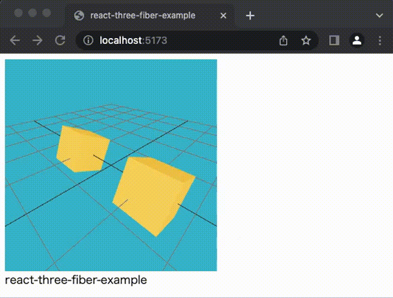

# react-three-fiber-example



## How to run the example.

```sh
% yarn install
% yarn dev

➜  Local:   http://localhost:5173/
```

## How to set up the initial construction.

1. Create vite

   ```sh
   % yarn create vite
   yarn create v1.22.19
   [1/4] 🔍  Resolving packages...
   [2/4] 🚚  Fetching packages...
   [3/4] 🔗  Linking dependencies...
   [4/4] 🔨  Building fresh packages...

   success Installed "create-vite@3.1.0" with binaries:
       - create-vite
       - cva
   ✔ Project name: … react-three-fiber-example
   ✔ Select a framework: › React
   ✔ Select a variant: › TypeScript
   ```

1. Add node modules

   ```sh
   % yarn add three @react-three/fiber
   % yarn add --dev @types/three
   ```

1. Edit App.tsx
